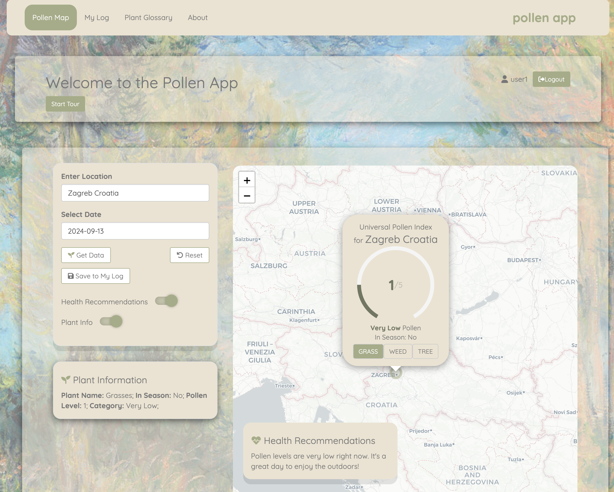

# Pollen App

(https://mandabaka.shinyapps.io/pollen_app/)

login credentials
Username: user2, Password: pass2
Username: user3, Password: pass3

## Overview

Pollen App is a comprehensive allergy management tool designed to help users monitor pollen levels, track their allergy symptoms, and make informed decisions about their outdoor activities. This Shiny application provides real-time and forecasted pollen data for locations worldwide, offering personalized health recommendations based on current pollen levels.

## Features

### 1. Pollen Map

**Global Coverage**: Access pollen data for over 65 countries worldwide.
**5-Day Forecast**: View pollen levels for the current day and up to 4 days in advance.
**Interactive Map**: Visualize pollen levels with an easy-to-use, color-coded map interface.
**Multiple Pollen Types**: Track levels for grass, tree, and weed pollen separately.

### 2. Personalized Logging

Symptom Tracking: Record daily allergy symptoms and their severity.
Data Visualization: View your symptom history alongside pollen levels in interactive charts.
Data Export: Download your log data in CSV or PDF format for sharing with healthcare providers.

### 3. Plant Glossary

Comprehensive Database: Access detailed information about selected various pollen-producing plants.
Visual Aids: View images of plants to aid in identification.
Allergen Information: Learn about cross-reactions and potential food allergies related to specific plants.

### 4. Health Recommendations

Personalized Advice: Receive tailored health recommendations based on current pollen levels and your logged symptoms.
Preventive Measures: Get suggestions for minimizing allergy symptoms and planning outdoor activities.

## PDF Reports

Data Visualization: Generate detailed PDF reports with interactive charts and graphs.
Symptom Analysis: View a breakdown of your symptoms over time, correlated with pollen levels.
Trend Identification: Easily identify patterns and trends in your allergy symptoms and their relation to pollen levels.
Shareable Format: Ideal for sharing with healthcare providers or for personal record-keeping.

The PDF Report feature transforms your raw data into actionable insights, helping you and your healthcare providers make informed decisions about your allergy management strategy.

### 5. User-Friendly Interface

Intuitive Design: Easy-to-navigate tabs for different features.
Responsive Layout: Optimized for both desktop and mobile viewing.
Interactive Tutorial: Built-in tour to guide new users through the app's features.

## Technologies Used

### R and Shiny

The core of the Pollen App is built using R and the Shiny framework, providing a robust and interactive web application experience.

### Google Pollen API

App utilizes the Google Pollen API to fetch real-time and forecasted pollen data, ensuring users have access to the most up-to-date information.

### Leaflet

The interactive map feature is powered by Leaflet, allowing for smooth and responsive geographical visualization of pollen data.

### Plotly

Dynamic and interactive charts are created using Plotly, enabling users to explore their symptom and pollen level data in detail.

### MongoDB

User data, including symptom logs and preferences, is securely stored and retrieved using MongoDB, ensuring efficient data management and quick access.

### Intro.js

The interactive tutorial feature is implemented using Intro.js, providing new users with a guided tour of the app's functionalities.

### Nominatim Geocoding Service

App uses the Nominatim service for geocoding, converting user-input locations to geographic coordinates for accurate pollen data retrieval.

## Data Management with MongoDB

The Pollen App uses MongoDB for efficient and secure data management. Here's how it works:

- User Data Storage: When users log their symptoms or save preferences, this data is stored in MongoDB.
- Data Retrieval: Upon app startup or user login, relevant data is fetched from MongoDB to populate the user's dashboard and charts.
- Efficient Queries: MongoDB's document-based structure allows for quick and efficient data retrieval, enhancing app performance.

## Interactive Tutorial with Intro.js

App features an interactive tutorial powered by Intro.js:

- Guided Tour: New users are taken through a step-by-step tour of the app's main features.
- Contextual Help: Each step provides information about a specific feature or how to use a particular part of the interface.
- User-Friendly: Users can start, pause, or skip the tutorial at any time, making it flexible and non-intrusive.
- Responsive Design: The tutorial adapts to different screen sizes, ensuring a consistent experience across devices.

## Installation

1. Clone the repository:
git clone https://github.com/yourusername/pollen-app.git
2. Install required R packages:
install.packages(c("shiny", "dplyr", "httr", "jsonlite", "leaflet", "ggplot2", "plotly", "mongolite"))
3. Set up environment variables for API keys and database connections.
4. Run the Shiny app

## Usage

1. Start the App: Launch the application and log in or create a new account.
2. Check Pollen Levels: Use the Pollen Map tab to view current and forecasted pollen levels for your location.
3. Log Symptoms: Record your daily symptoms and their severity in the My Log tab.
4. View Trends: Analyze your symptom history alongside pollen levels using the interactive charts.
5. Learn About Plants: Explore the Plant Glossary to learn more about selected pollen-producing plants in your area.

## Login Information

You can use the following login credentials:

Username: user2, Password: pass2
Username: user3, Password: pass3

## Contributing

Contributions to the Pollen App are welcome!

## License

This project is licensed under the MIT License - see the [LICENSE.md](LICENSE.md) file for details.

## Acknowledgments

1. Pollen data provided by the [Google Pollen API](https://developers.google.com/maps/documentation/pollen)
2. Geocoding services by [Nominatim](https://nominatim.org/)
3. Plant images sourced from [Wikimedia Commons](https://commons.wikimedia.org/) and [The New York Public Library Digital Collections](https://digitalcollections.nypl.org/)
4. [Intro.js](https://introjs.com/) for interactive tutorial

## Contact
For any queries or support, please contact marijanazunic@gmail.com
